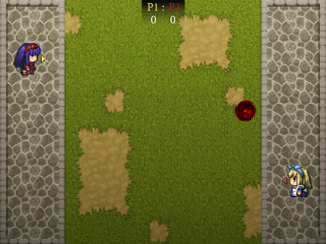
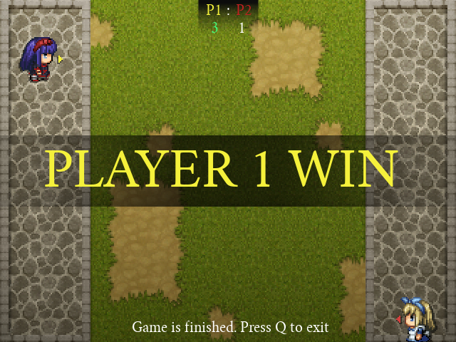

## Epic Ping-pong PyGame

An epic awesome ultra marvelous simple game I made in python (I am tasked to make this).

**Features:** 
- Player's sprite are animated
- Special appereance for the end game result
- Score for each player
- BGM and SFX
- And more..

*Preview:*

Control the player using W S and UP LEFT key. Player 1 are yellow, player 2 are red. Make sure the opposite player is not bouncing back the ball to gain 1 point. Win the game by reaching 3 point. I recommend it to play this game with your friend (IRL)
